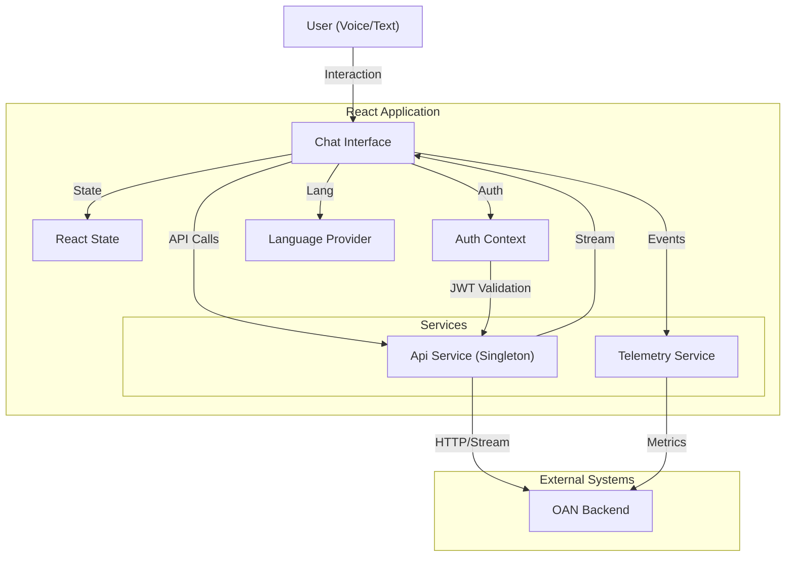

# oan-ui-service Technical Documentation

## 1. System Overview

**oan-ui-service** is a React-based frontend application designed to provide a conversational AI interface ("Vistaar"). It enables users to interact with an AI assistant via text and voice, supporting multiple languages (specifically Indian languages). The system is built for high responsiveness with streaming responses, real-time voice transcription (STT), and text-to-speech (TTS) capabilities. It also includes a robust telemetry system for tracking user interactions and system performance.

### Primary Object
To facilitate seamless, multilingual access to AI-driven information through a user-friendly web interface that supports both text and voice modalities.

---

## 2. Architecture & Design

The application follows a **Client-Side SPA (Single Page Application)** architecture using **React** and **Vite**.

### Design Patterns
-   **Component-Based Architecture**: UI is broken down into reusable components (e.g., `ChatInterface`, `ChatMessage`, `VoiceAssistantInline`).
-   **Context API for Global State**: React Context is used for global concerns like Authentication (`AuthContext`), Language (`LanguageProvider`), and Audio (`AudioPlayerProvider`).
-   **Singleton Pattern**: The API service (`api.ts`) is implemented as a singleton to manage a single Axios instance and shared configuration (auth tokens, retry logic).
-   **Container/Presentational pattern**: Pages (e.g., `ChatPage`) act as containers, while components in `src/components` handle presentation and specific interactions.
-   **JWT-based Authentication**: Uses `jose` library for JWT validation with a public key for token verification.

### Architecture Diagram



### Data Flow
1.  **User Interaction**: User inputs text or voice in `ChatInterface`.
2.  **State Update**: React state updates UI immediately (optimistic UI).
3.  **API Call**: `ChatInterface` delegates the request to `apiService`.
4.  **Backend Processing**: Request is sent to the backend (e.g., `/api/chat/`, `/api/transcribe/`).
5.  **Streaming Response**: For chat, the server streams the response chunk-by-chunk. `api.ts` handles the stream and calls a callback to update the UI progressively.
6.  **Telemetry**: Events (Question, Response, Error) are captured in parallel by `telemetry.ts` and sent to the observability service.

---

## 3. Module/Component Breakdown

### Core Directories
-   `src/pages`: Top-level route components.
-   `src/components`: Reusable UI elements and feature-specific blocks.
-   `src/contexts`: Global state providers.
-   `src/lib`: Utility functions, API clients, and telemetry logic.

### Key Components

| Component / File | Responsibility | Interactions |
| :--- | :--- | :--- |
| **`ChatInterface.tsx`** | The core chat controller. Handles message history, input state, recording logic, and coordinates API calls. | Calls `api.ts` for data. Uses `ChatMessage` to render items. Updates `telemetry.ts`. |
| **`api.ts`** | Centralized API client. Handles HTTP requests, authentication (JWT), streaming, and retries. | Used by almost all data-fetching components. Manages `localStorage` for tokens. |
| **`AuthContext.tsx`** | Manages user authentication state (Guest/Authenticated). Handles JWT validation and storage. | Wraps the entire `App`. Used by `PrivateRoute` and `ChatInterface`. |
| **`LanguageProvider.tsx`**| Manages the active language + translations. | Wraps `App`. Provides `t()` function to all components. |
| **`telemetry.ts`** | Implements V3 Telemetry specification. Tracks performance (TTFB, Render time) and user events. | Called by `ChatInterface` to log start/end of questions and responses. |
| **`VoiceAssistantInline.tsx`** | Handles inline voice interaction (microphone access, visualization). | Used inside `ChatInterface` for voice input. |
| **`AudioPlayer.tsx`** | Manages TTS playback queue and state. | Global provider used to play audio responses. |

---

## 4. Key Logic & Algorithms

### Authentication Logic (`AuthContext.tsx`)
The system uses a custom JWT-based authentication model supporting both guest and verified users.
1.  **Initialization**: On load, checks for authentication via:
    *   **URL Param**: Checks for `?token=...`. If found, validates and stores it.
    *   **LocalStorage**: Checks for existing valid `auth_jwt`.
    *   **Guest Fallback**: If no token, fetches a new token from `/chat/auth` API.
2.  **JWT Validation**: Uses `jose` library to verify the token signature against a hardcoded RSA Public Key (PEM format).
3.  **Token Storage**: Valid tokens are stored in localStorage with a 1-year expiration.

### Streaming Chat Response (`ChatInterface.tsx` & `api.ts`)
To reduce perceived latency, the chat responses are streamed.
1.  **Request**: `apiService.sendUserQuery` initiates a `fetch` request.
2.  **Stream Reading**: Uses `response.body.getReader()` to read raw bytes.
3.  **Decoding**: A `TextDecoder` converts bytes to text chunks.
4.  **Callback**: Each chunk is passed back to `ChatInterface`, which appends it to the current message state, triggering a re-render.
5.  **Telemetry**: Performance markers (Start Time, Network Start, Network End) are recorded to calculate TTFB (Time To First Byte).

### Telemetry & Performance Tracking (`telemetry.ts`)
1.  **Fingerprinting**: Uses `FingerprintJS` to generate a unique Device ID.
2.  **PerformanceObserver**: Watches for network resource entries related to `/api/chat/`.
3.  **Metrics Calculation**:
    *   **Server Response Time**: `responseEnd` - `responseStart`
    *   **Network Wait (TTFB)**: `responseStart` - `startTime`
    *   **Browser Render**: `paintTime` - `responseEnd` (Paint time is captured via `requestAnimationFrame` after the response is fully received).

---

## 5. API/Interface Reference

The `ApiService` class (`src/lib/api.ts`) exposes the following main methods:

### `sendUserQuery`
Sends a text query to the chat engine.
*   **Params**: `msg` (string), `session` (string), `sourceLang` (string), `targetLang` (string), `onStreamData` (callback)
*   **Returns**: `Promise<ChatResponse>`
*   **Behavior**: Supports streaming. On failure, retries based on `retry-utils`.

### `transcribeAudio`
Converts audio blob to text (STT).
*   **Params**: `audioBase64` (string), `serviceType` (e.g., "bhashini"), `sessionId`, `lang_code`
*   **Returns**: `Promise<TranscriptionResponse>` ({ text, lang_code, status })

### `streamTranscript` (TTS)
Fetches audio for a given text.
*   **Params**: `sessionId`, `text`, `targetLang`, `onBytes` (callback for stream)
*   **Returns**: `Promise<Uint8Array>` (Full audio buffer)
*   **Behavior**: Handles base64 encoded chunks in a JSON stream or raw binary.

### `fetchAuthToken`
Obtains a temporary auth token for guest users.
*   **Params**: `metadata` (string - browser info)
*   **Returns**: `Promise<string>` (JWT Token)

---

## 6. Dependencies

| Library | Purpose |
| :--- | :--- |
| **React** | Core UI library. |
| **Vite** | Build tool and dev server. |
| **Tailwind CSS** | Utility-first styling. |
| **Shadcn UI (@radix-ui)** | Accessible UI component primitives. |
| **Axios** | HTTP client for API requests. |
| **React Router Dom** | Client-side routing. |
| **Jose** | JWT verification and validation. |
| **FingerprintJS** | Device identification for telemetry. |
| **Lucide React** | Icons. |
| **ua-parser-js** | Browser/device detection. |

---

## 7. Setup & Usage

### Prerequisites
*   Node.js (v18+)
*   npm or bun

### Installation
1.  Navigate to the project directory:
    ```bash
    cd oan-ui-service
    ```
2.  Install dependencies:
    ```bash
    npm install
    # or
    bun install
    ```

### Development
Start the development server:
```bash
npm run dev
```
The app will be available at `http://localhost:5173` (default).

### Building for Production
Create an optimized build:
```bash
npm run build
```
The output will be in the `dist/` directory, ready to be served by Nginx or another static file server.

### Configuration
*   **Environment Variables**: Check `.env.example` for required keys (usually API endpoints).
*   **Public Key**: If changing the auth provider, ensure the Public Key in `AuthContext.tsx` matches the signing key of your token service.
